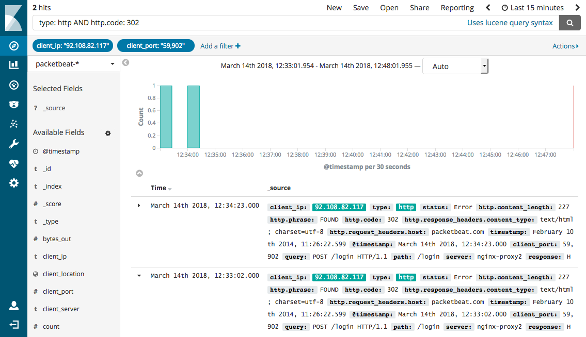

# How to use a context for base operations

This document outlines the concept of a 'global context' that enables all basic facilities to gather and disseminate 
metadata efficiently. The concept leverages several functionalities currently employed in microservice environments, 
mapping these concepts to a modular monolith.

## Definition of a context

When we refer to a 'context', we are speaking of a specific state. This state can be unique to the entire process or
specific to a thread. In HTTP based services such context is often used to store information about the current request.
In our scenario, the context can be leveraged to retain information about a current workflow, such as a transaction.

The data within a context is typically stored as a key-value map, implying that key-value pairs can be conveniently 
stored within a context. For simplicity, it is advisable to store pairs as strings. On this premise, a context can be 
defined by the following API draft:

```java

public interface Context {

    String get(String key);

    void set(String key, String value);

    void remove(String key);

    Stream<String> keys();

}

```

As mentioned, a common use case involves a thread-bound context, meaning that the context is linked to the current thread.
By using `ThreadLocal` this can be easily achieved, enabling static and straightforward access to the `ThreadContext`:

```java

ThreadContext.set("key","value");

```

## The advantage of having context based metadata

The benefit of having a context based metadata is that it can be used by all base facilities for data collection and 
distribution. A common use case is logging, where the metadata from a context can be automatically appended to all 
processed log messages. The following illustrations provides an example of that behavior:


By implementing this, a simple log.info("Hello World") call can generate the following log message:

```
2023-06-07T11:50:17.345943 - INFO - Hello World - {spanId=5e337baa-1bb8, nodeId=0x3d4e, thread=Thread-1}
```

In the provided example, the information enclosed within the curly brackets represents the context metadata, which is 
automatically appended by the logger. This pattern is known as *MDC* (Mapped Diagnostic Context) in logging, offering 
numerous advantages. While the log line already offers valuable information, it becomes even more compelling when we 
utilize a log aggregation tool such as *ELK* (Elasticsearch, Logstash, Kibana). With such a tool, we can effortlessly 
search for all log messages related to a specific transaction or workflow. The following illustration provides an 
example of this:



As evident in the image, such tools can manage the metadata of log messages (as defined, for example, in the GELF 
format) and offer insightful views and visualizations of this metadata. Similar to Prometheus and Grafana, we can 
develop a Docker-based environment for our own log aggregation tooling, making this functionality accessible 
to all developers.

## How a resource manager can use the context

In the future, we aim to establish a so-called resource manager that will oversee the lifecycle of resources like 
threads. This manager can supply a wealth of information to the context. Let's envision that we have a specific 
resource manager for the platform and another for the node. Whenever a `Thread` is created, the resource manager can 
instantly add pertinent information to the thread context of the new thread. Such information may include the resource 
manager ID, the thread name, and the thread type (native or virtual), for example. As we begin to utilize the [Java 
concurrency API](https://docs.oracle.com/javase/8/docs/api/index.html?java/util/concurrent/package-summary.html) 
more extensively, instead of using the Thread class directly, we can also define task information like 
the task type and description in the context. A custom Executor can be effortlessly crafted to add such information to 
the context before executing a task. The following code snippet offers a glimpse of what that might look like:

```java

resourceManager.executeTask("checkAccountBalance","This tasks checks the account balance for "+account,()->{
        // do something
        });

```

As long as the `Runnable` that is passed as a lambda expression is executed, the task-related context information 
remains stored within the context:

```java

assert"checkAccountBalance".equals(ThreadContext.get("taskName"));
        assert"This tasks checks the account balance for 0x3de4a".equals(ThreadContext.get("taskDescription"));

```

When a logger is used inside the task we will have a lot of information  is automatically appended to the log message. 
The following block provides an idea of the metadata that could be incorporated into such a log message:

```
resourceManagerId=0x3d4e
thread=Thread-1
taskName=checkAccountBalance
taskDescription=This tasks checks the account balance for 0xf424a
```

## Adding tracing

The previous example already furnishes numerous details that can be used for tracing. Tracing is a common pattern 
utilized by microservice environments to monitor the flow of a transaction or a request across multiple services. The 
following illustration provides an example of this:


The illustration depicts a request being processed by multiple services. In each service, a span is created that forms 
part of a trace. The trace ID is used to identify the entire request, while the span ID is used to identify the current 
service. Additionally, a span can have a parent span.

While tracing is predominantly used in a microservice environment, it can also be effectively implemented in a monolith. 
Let's suppose we define start and end timestamps for each task that is executed. With this information, we can easily 
create a span for that task. In such a concept, a span already holds a wealth of information that we could store in the 
thread context. The following illustration provides a generic overview of how this behavior might appear:


When a logger is used within a span, we will once again have additional information that is automatically appended to 
the log message:

```
resourceManagerId=0x3d4e
thread=Thread-1
taskName=checkAccountBalance
taskDescription=This tasks checks the account balance for 0xf424a

spanId=0xdd56e
spanType=checkAccountBalance
spanParentId=0x67f4a
spanStart=2023-06-07T11:50:17.345943
```

Given that the spans are tied to the resource management of the application, we can effortlessly create a span for each 
task that is executed. In doing so, we don't even need to modify the code of the resource manager. The manager will 
automatically generate a span. If the calling thread already has a span, we can use that span as a parent span. If not, 
we can create a span without a parent span. The following code snippet demonstrates how that might look:

```java
resourceManager.executeTask("executePreHandles","Executes preHandlers for "+transactionId,()->{

        // do something

        resourceManager.executeTask("checkAccountBalance","checks  balance for "+accountId,()->logger.info("Hello World"));

        });

```

In the provided scenario, the log message would contain information about the current span and could even be linked to 
the task that initiated the inner task, as we are aware of the parent span's ID.

## Visualize tracing

Grafana is currently developing a new tracing feature for its platform that can be used to visualize traces. As we are 
already using Grafana, this would be a perfect fit for us. Like any other service, we can offer this functionality 
directly to the developers to examine spans for performance issues. The following illustration depicts an example of 
spans visualized in Grafana:


To visualize spans, we need to present the span information in a specific format, much like we do with our metrics. 
Open Telemetry already provides a [specification] 
(https://github.com/open-telemetry/opentelemetry-specification/blob/main/specification/overview.md) for this. Given that
Open Telemetry is increasingly used within the industry, it would make sense for us to support this format. As the 
tracing in Open Telemetry provides a wealth of functionality that we do not require (information about microservices, 
HTTP requests, etc.), we could offer a more lightweight API that employs Open Telemetry internally.

## Measure performance automatically

Thanks to our metrics API, we can easily measure the performance of each span and span type. Suppose the span API uses 
the metrics API internally and records execution times (average, max, min) for each span type. In doing so, we would 
automatically obtain information about the performance of each span type.

## Going down the rabbit hole: Measure performance of locks

While the approach given is often used to measure the performance of services in a microprofile environment, it provides
all the necessary information and functionality to measure much smaller units. Let's assume we want to measure the 
performance of a lock. We already have a quite robust API for handling locks using the `AutoLock` and our `Locks` 
facade. Currently, creating and using a lock to secure a resource looks like this:

```java
AutoLock lock=Locks.createLock();

        try(var ignore=lock.lock()){
        // use locked resource 
        }

```

Suppose we add a `String` parameter to the `createLock()` method that is used as the type definition of spans created 
whenever the lock instance is locked. Since each span records execution times (average, max, min) in metrics, we could 
automatically gather information about the usage of resources and identify which resources/locks might need refactoring 
for improved performance. The following code snippet illustrates how that might look:

```java
AutoLock lock=Locks.createLock("transactionQueue");

        try(var ignore=lock.lock()){
        // use locked resource 
        }

```

One potential issue when working with small spans is the resulting increase in total number of spans. This could 
potentially lead to complications when visualizing the data. Although the metrics can provide an overall picture of 
each span type's performance, we may still need specific numbers for individual span instances at runtime for 
detailed analysis.

## Making use of JFR

Java 11 introduced the Java Flight Recorder (JFR) API as a part of the JDK, providing a powerful tool to measure Java 
application performance. One of the standout features of JFR is its support for custom events. This allows an 
application to define and trigger custom JFR events during its execution.

These events can be monitored by any tool that supports JFR, such as Java Mission Control (JMC) or IntelliJ.
For instance, IntelliJ's Profiler can be employed to inspect a running application and gather all its JFR events. 
This capability enables us to collect and analyze all the necessary JFR events from a running application with 
relative ease.

Moreover, if we configure our application so that the end of each span triggers a custom JFR event, we can leverage 
these events to scrutinize the performance of a specific span type in IntelliJ by examining each individual event. 